# Install_VM
VM與網路安裝教學
Install VirtualBox
=============

### Download VirtualBox
* 方法1：先透過下方網站下載VirtualBox & extension  
url: https://www.oracle.com/virtualization/technologies/vm/downloads/virtualbox-downloads.html
* 方法2：也可以指定版本安裝  
url (v6.1.36 virtualbox): https://download.virtualbox.org/virtualbox/6.1.36/VirtualBox-6.1.36-152435-Win.exe

### Install VirtualBox
過程省略    
    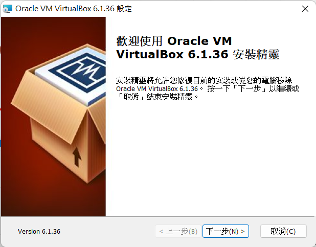    

Create VirtualMachine
=============

### Download Image
* 方法: 先去下載image，下面是ubuntu20.04 server的下載點  
url: https://ftp.ntou.edu.tw/ubuntu-releases/focal/  

### VM initial (Ubuntu Server)
1. Select **English(US)** # 不要選中文，格式轉換會有問題
  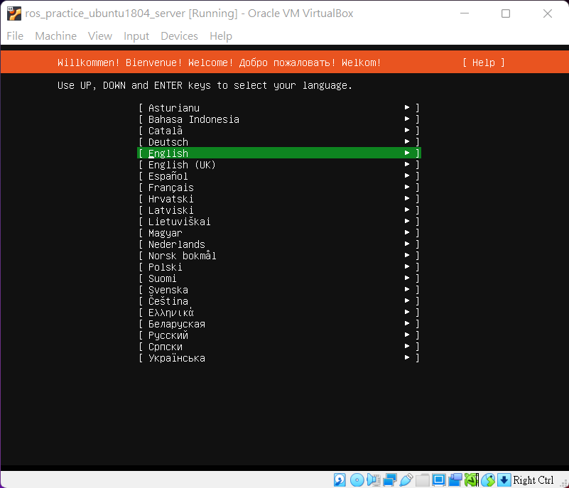 
2. 保持預設，接著 **Continue without updating**  
  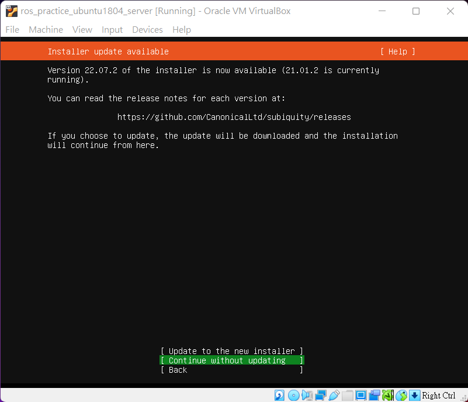 
3. 保持預設，接著 **Done**  
  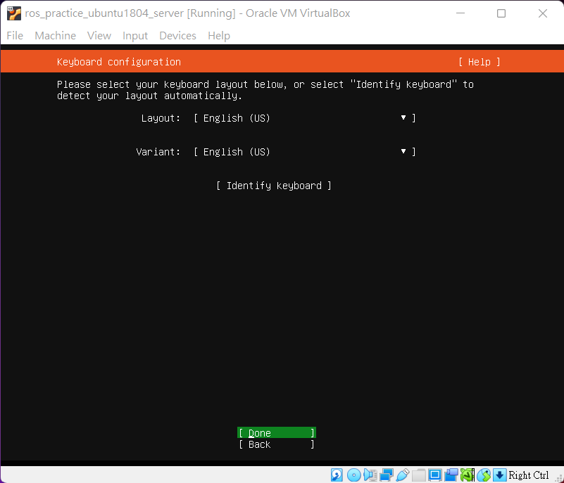  
4. 保持預設，接著 **Done**
  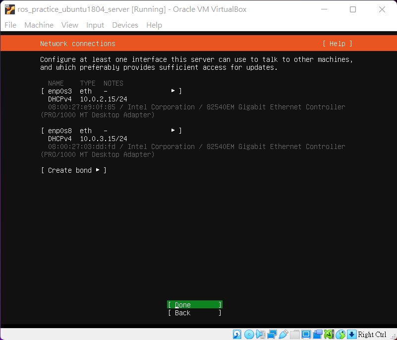  
5. 保持預設，接著 **Done**
  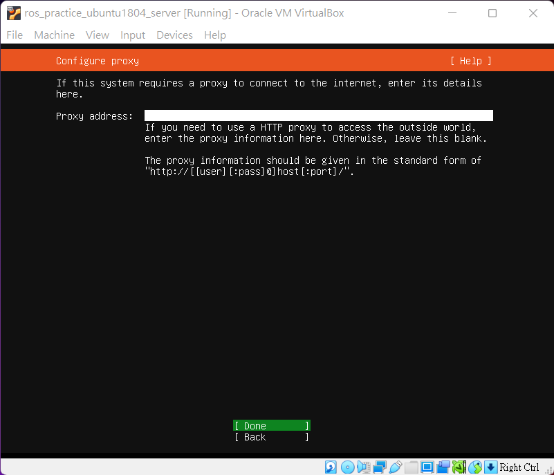  
6. 保持預設，接著 **Done**
  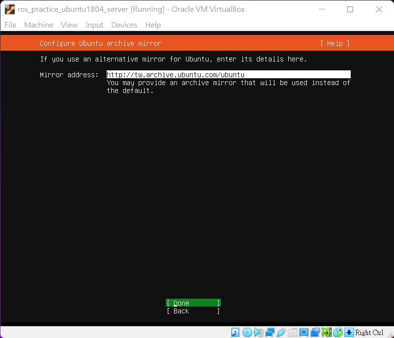  
7. 保持預設，接著 **Done**
  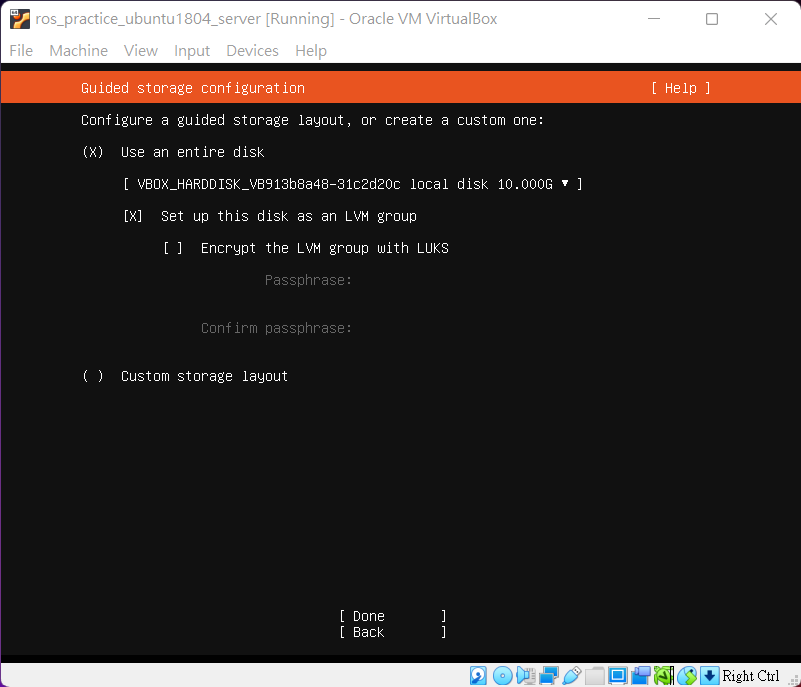 
8. 保持預設，接著 **Done**
  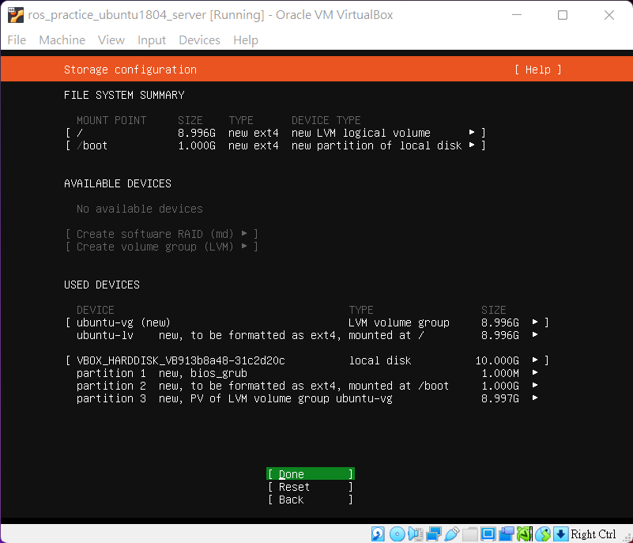 
9. Select **Continue**
  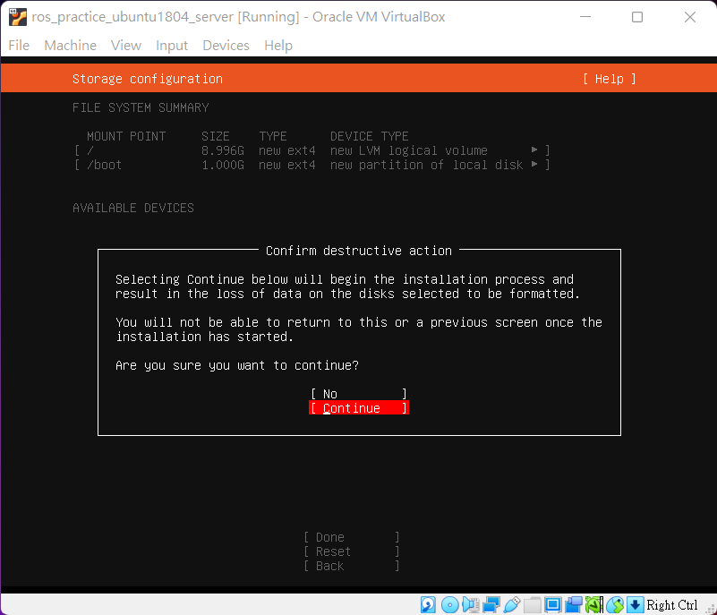  
10. Fill in Login info
  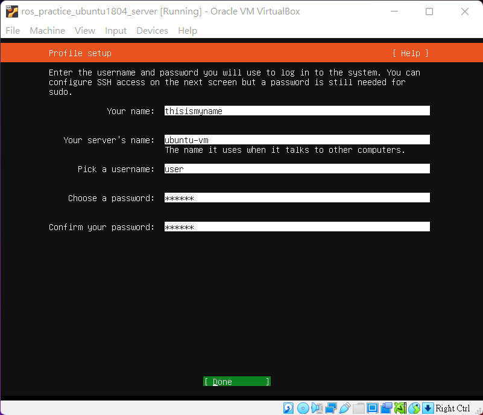  
11. 保持預設，接著 **Done**
  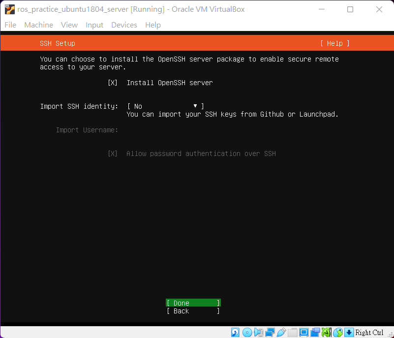  
12. 保持預設，接著 **Done**
  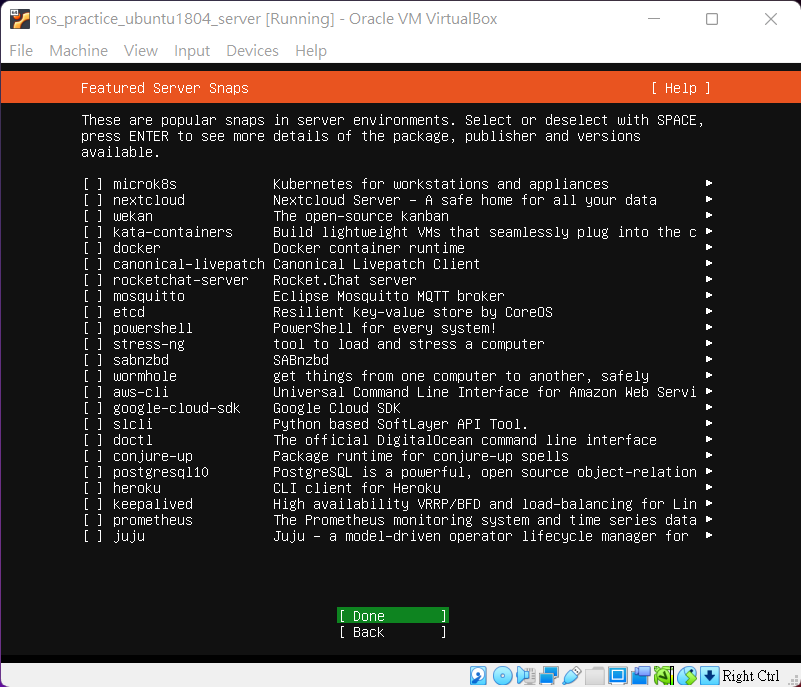  
13. Wait for running
  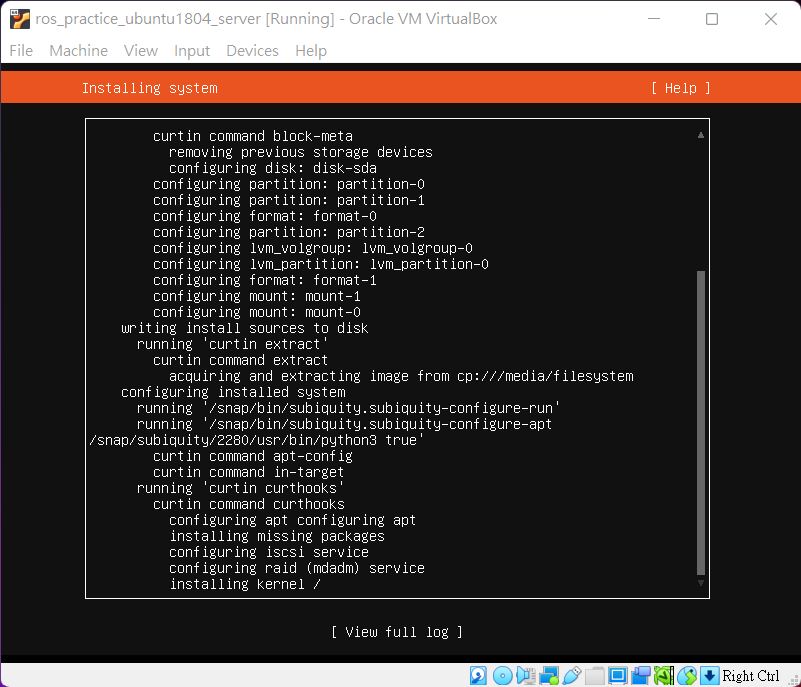  
14. 你可以選擇提早Reboot
  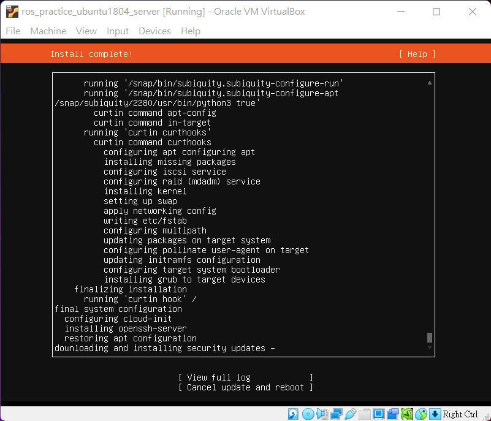  
15. Press Enter! **# 若是實體機，請記得移除usb**
  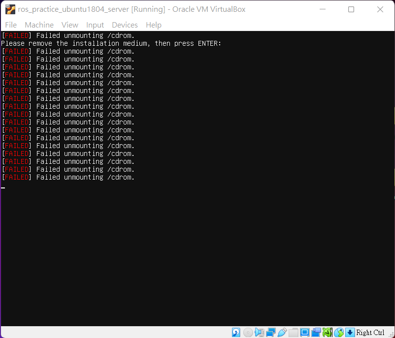  
16. login, then VM is ready.
  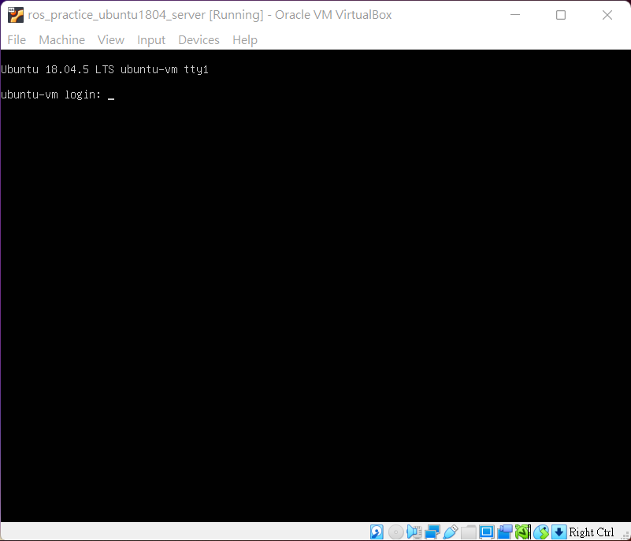  

Open SSH Service (Secure Shell)
===
### Install Openssh-Server
    $ sudo apt-get update
    $ sudo apt install openssh-server

### NetPlan Settings
    $ cd /etc/netplan
    $ ls
// 在/etc/netplan中會找到一份.yaml檔

### 修改yaml檔中的內容  
    # /etc/netplan/*.yaml 
 
    network:  
    ethernets:
    enp0s3:     # 這裡是網卡名稱，請下 $ip a 查看
      addresses: [10.135.170.200/24]    # IP Address
      gateway4: 10.135.170.1            # 尾數通常是1或是254
      nameservers: 
        addresses: [8.8.8.8, 8.8.4.4]
      dhcp4: no
    version: 2

### 檢查netplan的修改
    $ sudo netplan try 
    $ ip a        // 檢查ip

    $ sudo netplan apply
    $ ip a        // 確認最終修改的ip

---

### VM all-in-one
可參考以下document  
url: https://github.com/jai-9110/Harmonia-FL/tree/main/VM%E8%A8%AD%E5%AE%9A

### 透過學校網路連線進實驗室機器
可參考以下document  
url: https://github.com/jai-9110/Harmonia-DFL/tree/main/Mobaxterm%E8%A8%AD%E5%AE%9A

ps. 目前AI組機器無法使用學校VPN，建議在實驗室或至少在校園網路內進行工作
